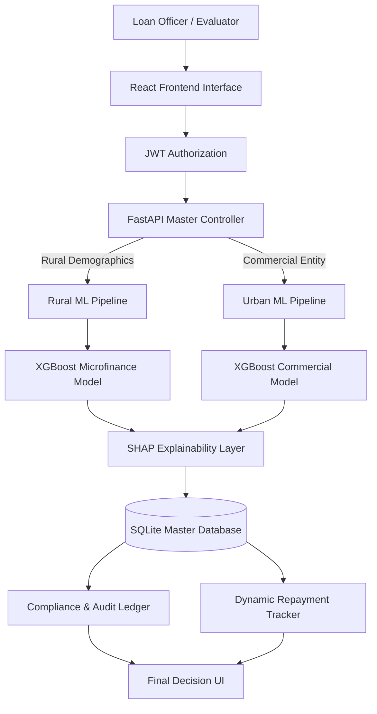

# Dual-Mode AI Lending System

<div align="center">

**A Deterministic Financial Evaluation System augmented by Explainable AI (XAI)**

[](https://fastapi.tiangolo.com/)
[](https://reactjs.org/)
[](https://xgboost.readthedocs.io/)
[](https://shap.readthedocs.io/)
[](https://www.sqlite.org/)

*Combining high-performance credit modeling with human-readable transparency.*

</div>

---

## 📖 Table of Contents

1. [Project Overview](#-project-overview)
2. [Design Philosophy](#-design-philosophy)
3. [Data & ML Pipeline](#-data--ml-pipeline)
4. [System Architecture](#-system-architecture)
5. [Key Features](#-key-features)
6. [Tech Stack](#-tech-stack)
7. [Project Structure](#-project-structure)
8. [Setup & Installation](#-setup--installation)
9. [Usage Guide](#-usage-guide)
10. [API Guide](#-api-guide)
- [License](#license)

---

## 🎯 Project Overview

The **Dual-Mode AI Lending System** is a full-stack decision-support platform designed to streamline credit risk evaluation across two vastly different economic demographics: the unbanked rural sector and the established urban commercial sector.

Unlike standard "black-box" AI systems that spit out a score without context, this system adheres to a strict **"Explainable First"** architecture.

*   **Deterministic Workflows**: Core financial attributes (EMI, max loan limits, schedules) are calculated pre- and post-prediction via deterministic Python logic.
*   **Explainable AI Layer**: Predictions are strictly annotated using SHAP values to generate human-readable sentences justifying every decision.

---

## 📝 Design Philosophy

Our system is built around core principles prioritizing transparency and fair access to capital:

1.  **Context-Aware Scoring**: An Urban applicant is scored fundamentally differently than a Rural one. Our system provisions discrete paths (Models & UIs) for each.
2.  **Explainability (XAI)**: No black boxes. Every approval or rejection is mathematically justified and mapped to plain English.
3.  **Actionable Intelligence**: We don't just output risk bands. The system generates safe lending limits and dynamic interest rate suggestions.
4.  **Operational Traceability**: Every evaluation, overridden value, and payment log is immutably recorded for auditability.

---

## 🔄 Data & ML Pipeline

The system is built on a robust machine learning pipeline that transforms raw tabular data into highly accurate risk assessments.

### 1. Exploratory Data Analysis & Cleaning
**Source**: `notebooks/01_EDA_and_Cleaning.ipynb`
*   **Target**: The Home Credit Default Risk Dataset & Synthetic Rural Finance datasets.
*   **Processing**:
    *   Handled missing values natively using statistical imputation and median replacements.
    *   Designed currency-neutral features like `Debt-to-Income (DTI)` ratios.
    *   Engineered synthetic behavioral proxies for unbanked individuals (e.g., `water_availability`, `social_class`, `type_of_house`).

### 2. Model Training & Validation
**Source**: `notebooks/02_model_training.ipynb`
*   **Algorithm**: Utilized **XGBoost** (Extreme Gradient Boosting), the industry default for tabular financial modeling.
*   **Methodology**:
    *   Split the pipelines into entirely separate tracks for **Rural** (Microfinance) and **Urban** (Commercial) prediction.
    *   Handled severe class imbalances (typical in loan default data) using `scale_pos_weight` and SMOTE where applicable.
    *   Optimized hyperparameters using Randomized Search for optimal ROC-AUC scoring.

### 3. Explainability Engineering
*   **Integration**: Seamlessly hooked the trained `.pkl` models into the **SHAP** library.
*   **Runtime Action**: At inference time, the backend calculates Shapley values for the specific applicant's row, extracting the top 3 high-risk and low-risk features, compiling them into the requested human-readable JSON narrative.

---

## 🏗️ System Architecture



*   **FastAPI Inference Engine**: Acts as the master controller, directing incoming JSON data to either the Rural or Urban machine learning pipelines in real-time.
*   **Hybrid Model Execution**:
    *   **Rural**: "Assess this unbanked farmer" -> Routes through the custom Synthetic XGBoost model prioritizing behavioral risk proxies.
    *   **Urban**: "Assess this commercial entity" -> Routes through the Home Credit XGBoost model relying strictly on aggregated bureau data.
*   **SHAP Value Explainer**: The crucial XAI layer intercepting raw numeric floats and transforming them into readable string narratives ("HIGH RISK: Primary Business is Agriculture").
*   **Repayment Engine**: An independent state machine managing post-approval operations, dynamically altering principal calculations directly against the SQLite Database.

---

## 🚀 Key Features

### 1. Dual-Prediction Engines

*   **Rural Engine (Microfinance)**
    *   Designed for high-risk, unbanked individuals.
    *   Synthesizes hidden features and behavioral risk proxies (e.g., water access, social class, collateral).
    *   Calculates dynamic affordability limits based on projected disposable income.

*   **Urban Bureau (Commercial)**
    *   Built for established enterprises.
    *   Simulates external credit bureau aggregated data endpoints.
    *   Processes 20+ specific financial features (e.g., Credit Utilization, Refusal Rates).

### 2. Core Platform Capabilities

*   **Explainable AI Insights**: Instantly generates SHAP-driven narratives explaining the primary drivers behind an applicant's risk score contextually.
*   **Interactive Repayment Tracker**:
    *   Automatically generates reducing-balance EMI schedules.
    *   Allows officers to override disbursed loan amounts pre-generation based on AI "Safe Limit" suggestions.
    *   Logs tracking statuses (`PAID`, `PARTIAL`, `MISSED`) with visual health indicators.
*   **Immutable Audit Dashboard**: A complete historic ledger tracking who applied, who evaluated them, the raw JSON submitted, the score, and the final manual loan status.
*   **Modern UI Engine**: A dark-mode, neon-accented UI built explicitly for low-fatigue high-data entry.

---

## 💻 Tech Stack

Our stack is engineered to represent a realistic, production-ready AI fintech pipeline, prioritizing in-memory model execution speed over decoupled complexity.

### Frontend Layer
*   **React (Vite)**: Lightning-fast component rendering and hot module replacement.
*   **React Router v6**: Client-side SPA navigation.
*   **Axios**: Promise-based HTTP client for API interaction.
*   **Lucide React**: Crisp, modern UI iconography.
*   **Vanilla CSS**: Custom dark-theme variables for complete design control without heavy CSS frameworks.

### Backend / AI Serving Layer
*   **FastAPI (Python)**: High-performance ASGI framework. Chosen specifically because it allows ML models to reside in the exact same memory space as the web server, ensuring ~50ms inference times.
*   **Pydantic v2**: Strict, robust request/response validation ensuring the ML models never receive malformed data.
*   **Uvicorn**: Lightning-fast ASGI server.
*   **PyJWT & Passlib**: Secure, stateless token-based authentication.

### Data & ML Engineering Layer
*   **XGBoost**: Gradient Boosted Decision Trees modeling credit risk. Industry standard for tabular financial data.
*   **SHAP**: (SHapley Additive exPlanations) Mathematically breaks down model predictions into feature-level impacts.
*   **Pandas / NumPy**: Feature engineering pipelines executed directly prior to prediction.
*   **SQLite**: Zero-config relational database utilized via SQLAlchemy ORM for the Audit Ledger and Repayment logic.

---

## Getting Started

### Prerequisites

Ensure you have the following installed:
- **Python 3.9+**
- **Node.js** (v18 or higher)
- **npm** or **yarn**

### Installation

1. **Clone the Repository**
   ```bash
   git clone https://github.com/yourusername/Dual_Mode_AI_Lending_System.git
   cd Dual_Mode_AI_Lending_System
   ```

2. **Backend Setup**
   ```bash
   cd backend
   python -m venv venv
   source venv/bin/activate  # On Windows: venv\Scripts\activate
   pip install -r requirements.txt
   ```

   *Run the Backend Server:*
   ```bash
   uvicorn app.main:app --reload --port 8000
   ```
   *The backend will be available at `http://localhost:8000` and auto-generate the SQLite database (`lending_app.db`).*

3. **Frontend Setup**
   ```bash
   cd ../frontend
   npm install
   ```

   *Run the Frontend Development Server:*
   ```bash
   npm run dev
   ```

### 4. Access the Application
- Frontend: `http://localhost:5173` (or port provided by Vite/React)
- Backend API Docs (Swagger): `http://localhost:8000/docs`

---

## 💡 Usage Guide

### 1. Conducting a Loan Assessment
*   Navigate to either the **Rural Engine** or **Urban Bureau** from the main dashboard.
*   Input the borrower's exact financial details (e.g., Annual Income, Loan Tenure, Dependents).
*   Click **"Evaluate via AI Engine"**. The system will immediately predict default risk, output a decision, and generate 4-5 bulleted explanations detailing *why* that choice was made using SHAP.

### 2. Monitoring the Compliance Ledger
*   Click the **Compliance** tab in the navigation bar.
*   You will see an immutable ledger of every application tested against the AI.
*   Clicking on any row opens a deep-inspection modal showing the exact JSON body submitted by the loan officer.

### 3. Activating a Repayment Schedule
*   For any strictly **Approved Rural Loan**, click the **⚡ Activate** button in the Compliance table.
*   Set the official **First EMI Date** and arbitrarily override the **Disbursed Amount** (The UI explicitly provides the AI Safe Limit as a clickable hint).
*   Generate the schedule, and you will be routed to the Repayment Dashboard tracking all 24-36 months of the borrower's payments!

---

## 📦 Project Structure

```
Dual_Mode_AI_Lending_System/
├── backend/
│   ├── app/
│   │   ├── main.py            # FastAPI entry point & core routes
│   │   ├── models.py          # SQLAlchemy database models
│   │   ├── schemas.py         # Pydantic models for validation
│   │   ├── database.py        # SQLite connection setup
│   │   ├── auth.py            # JWT Authentication logic
│   │   └── ml_service/        # Machine Learning operations
│   │       ├── ml_engine.py   # XGBoost & SHAP evaluation logic
│   │       └── models/        # Pre-trained XGBoost weights (.pkl)
│   ├── requirements.txt
│   └── lending_app.db         # Auto-generated SQLite database
│
├── frontend/
│   ├── src/
│   │   ├── App.jsx            # Main React layout & routing
│   │   ├── RuralApp.jsx       # Rural Engine Interface
│   │   ├── UrbanApp.jsx       # Urban Bureau Simulator
│   │   ├── AuditDashboard.jsx # Compliance & History Tracker
│   │   ├── RepaymentTracker.jsx # EMI & Payment schedules
│   │   ├── Login.jsx / Signup.jsx
│   │   ├── AuthContext.jsx    # Global state for JWT tokens
│   │   └── index.css          # Custom styling
│   ├── package.json
│   └── vite.config.js         # (if using Vite)
```

---

## API Documentation

The backend utilizes FastAPI, providing automatic, interactive API documentation. Start the backend and navigate to `/docs` or `/redoc` to test the endpoints directly.

### Core Endpoints

| Method | Endpoint | Description |
|--------|----------|-------------|
| POST | `/auth/token` | Login and retrieve JWT |
| POST | `/auth/signup`| Register new loan officer |
| POST | `/api/predict/rural` | Evaluate rural applicant & return SHAP explanations |
| POST | `/api/predict/urban` | Evaluate urban enterprise with bureau simulation |
| GET  | `/api/history` | Retrieve user-specific loan history for auditing |
| POST | `/api/loans/{id}/activate`| Activate rural loan and generate EMI schedule |
| GET  | `/api/loans/{id}/schedule`| View monthly repayment schedule for active loan |
| PATCH| `/api/loans/{id}/payments/{month}` | Log an EMI payment (Paid/Partial/Missed) |

---

## License

This project is licensed under the MIT License.
